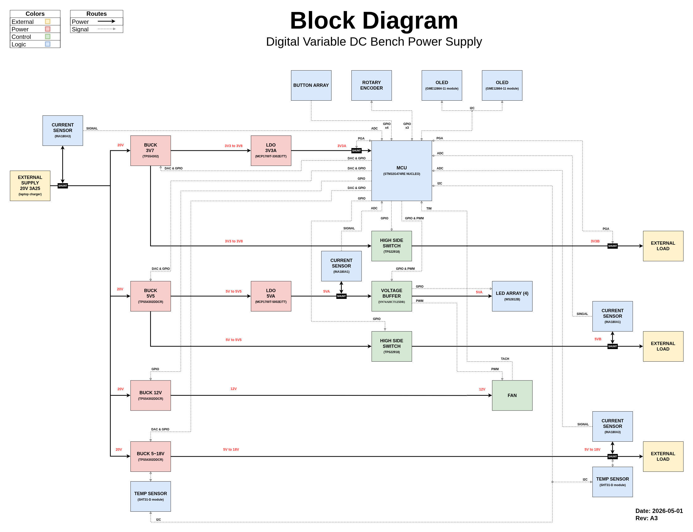
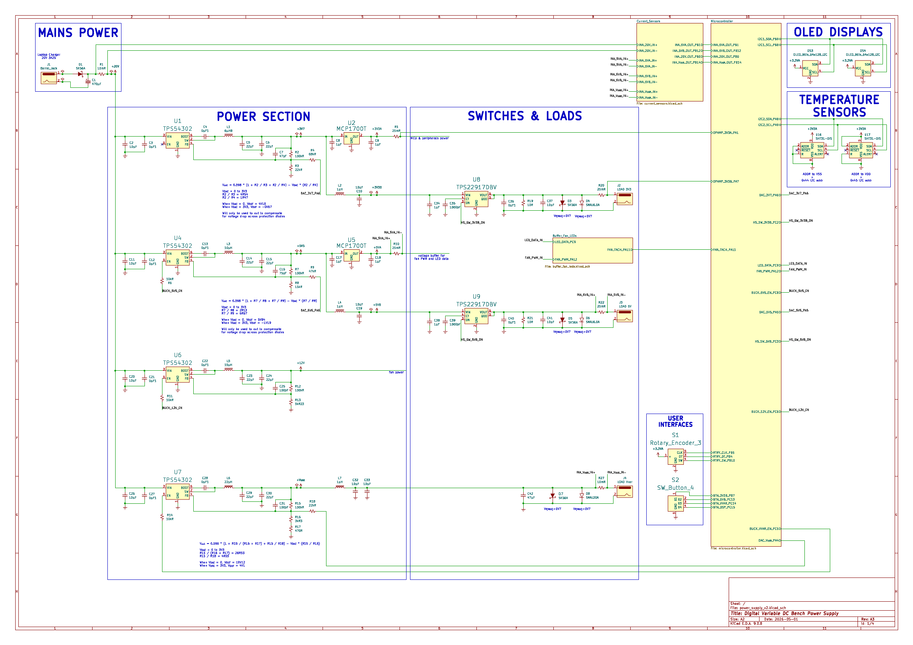
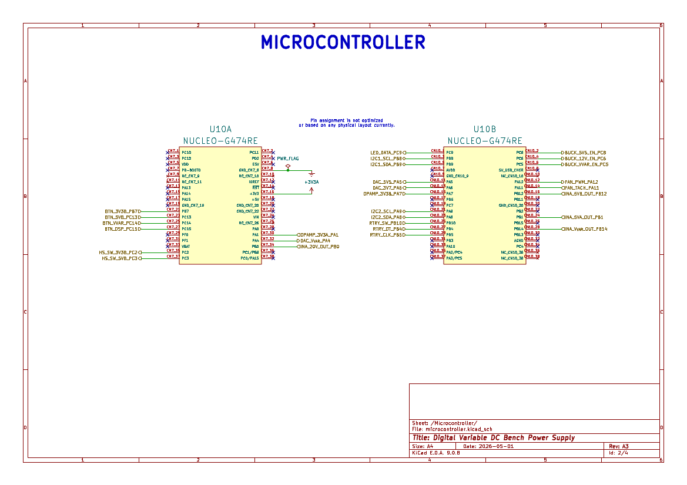
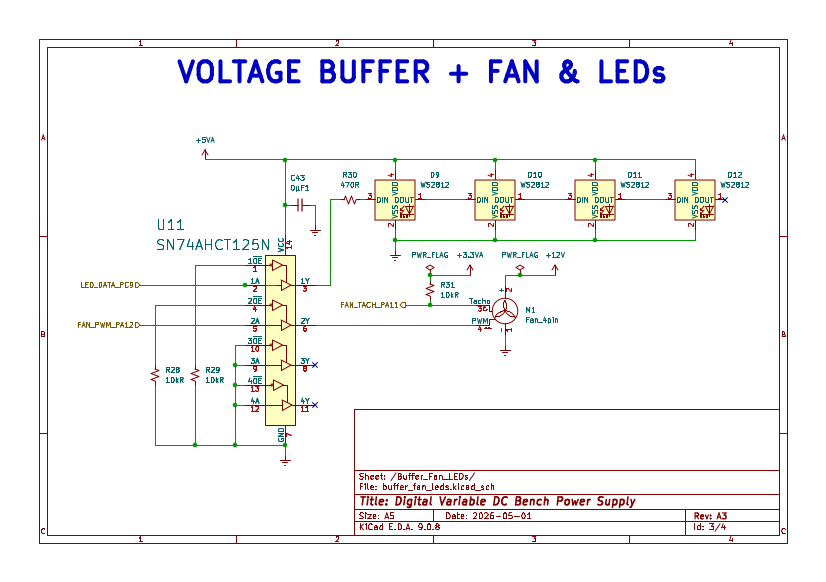
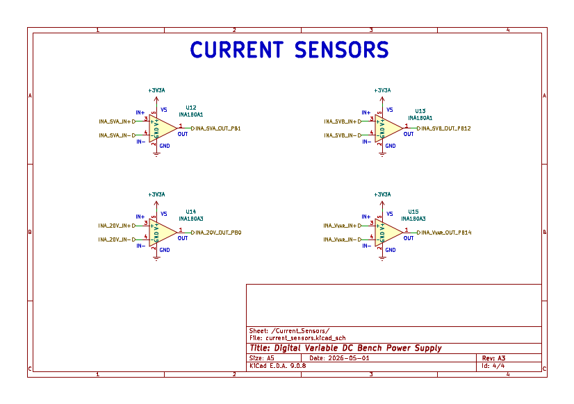

# Power Supply V2

This has been an ongoing and iterative project to explore and learn embedded systems. The [first version](https://github.com/c-malecki/power_supply) served as a discovery phase, utilizing hardware modules primarily in order to gain a high-level understanding of power supply design and electrical engineering/embedded systems. Due to complications and limitations of the component selection and having learned enough to make more informed choices, I started working on V2 as the real prototype.

## V2 Core Features

### Power Rails
- Fixed 3.3V and 5V rails for external loads
- Variable 5V to 18V rail for external load
- Independent output for simultaneous connections
- PID control loop to ensure consistent and accurate output of power rails

### Safety Systems
- Continuous power and temperature monitoring
- Hardware and firmware based protections for reverse polarity, back EMF, overvoltage, overcurrent, and overtemperature
- Automatic shutoffs in stages depending on severity of fault, e.g. single power out rail, whole rail (internal and external), full power shutoff
- RGB LED status indicators and debug blink codes

### User Interface
- Two OLED displays; one for system menu and configuration and the other for display data such as voltage, current, and temperature measurements, power consumption, and warnings/errors
- Button based toggling to turn external rails on/off and cycle through data display screens
- Rotary encoder for navigating system menus, making selections, and changing configurations

## Block Diagram

## Schematic

