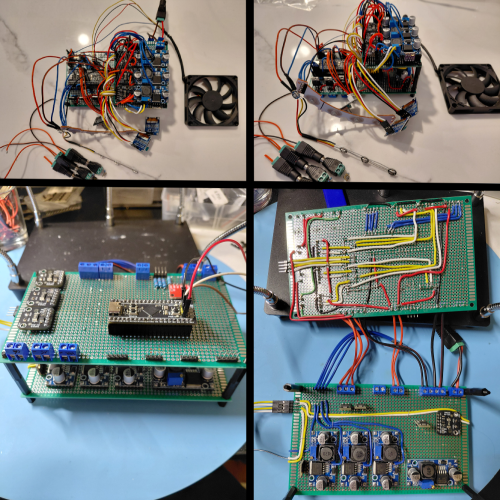
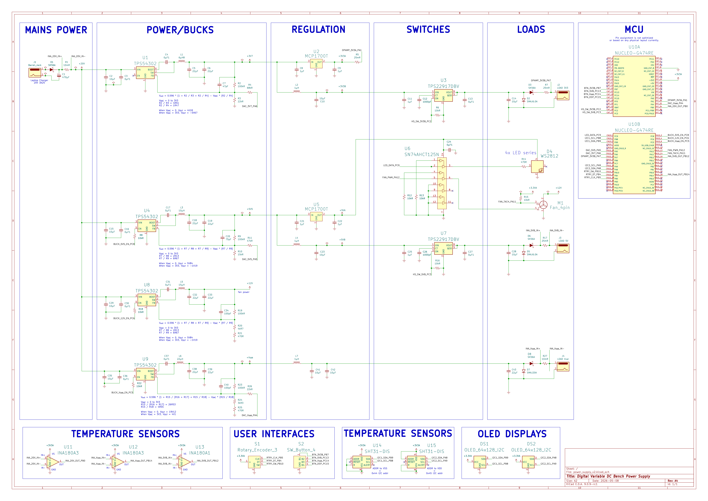

# Power Supply V2 (Prototype)

## Project Background

Building my own power supply has has been an ongoing and iterative project to explore and learn embedded systems. Designing and building my own tools seemed like a great way to work on something with a real use case and grow my knowledge and skill via iterative design and progressive loading of new concepts and methodologies in stages.

### Previous Iterations

The [first version](https://github.com/c-malecki/power_supply) served as a discovery phase, utilizing hardware modules primarily in order to gain a high-level understanding of power supply design and electrical engineering/embedded systems. Due to complications and limitations of the component selection (*particularly I2C issues with many undocumented modules and whether they have internal pull-up resistors*) and having learned enough to make more informed choices, I started working on V2 as the real prototype.

<figure>
  
  <figcaption>Some previous iterations and layouts that inevitably became a rat's nest.</figcaption>
</figure>

### V2 Learning Goals:

- __Use EDA software to create schematic diagrams__: Use KiCad 9 to create schematics, revise the design over the course of the project, and learn best practices in schematic diagramming
- __Design circuits using discrete component selections__: Hand select components and perform the calculations required to support intended operation as opposed to hardware modules (*with the exception of reusing OLED and temperature sensor modules*)
- __Increase datasheet and documentation fluency__: Relying on vendor sources primarily for application considerations and calculations

### V2 Exclusions:

- __PCB design:__ I am assembling this prototype using perfboard and handsoldering due to ease of error correction and rearrangement of circuits
- __Advanced Data Features:__ Although data will be read and displayed, I am leaving out advanced integrations like real-time communication with a host PC for logging and analyzing data. I intend to do a "V3" where I will do PCB design and add in support for more complex firmware features.

## V2 Core Features

*This list is subject to change as I continue to work through the prototyping process.*

### Power Rails
- Fixed 3.3V and 5V rails for external loads
- Variable 5V to 18V rail for external load
- Independent output for simultaneous connections
- PID control loop to ensure consistent and accurate output of power rails

### Safety Systems
- Continuous power and temperature monitoring
- Hardware and firmware based protections for reverse polarity, back EMF, overvoltage, overcurrent, and overtemperature
- Firmware controlled shutoffs in stages depending on severity of a fault (*e.g. individual power rail shutoff for external connections, full power rail shutoff for internal and external connections, full system shutoff*)
- RGB LED status indicators and debug blink codes
- Warning and error displays

### User Interface
- OLED for system menu containing configuration settings
- OLED for data display screens such as operating conditions
- Buttons for toggling external rails on/off and cycling through data display screens
- Rotary encoder for navigating system menus and making selections

## Hardware Design

### Component Selection

- [STM32G474RE Nucleo](https://www.st.com/resource/en/datasheet/stm32g474cb.pdf)
- 20V 3.25A Laptop Charging Brick with added 3A slow-blow fuse
- [TPS54302 buck converters](https://www.ti.com/lit/ds/symlink/tps54302.pdf)
- [MCP1700 LDOs](https://ww1.microchip.com/downloads/en/DeviceDoc/MCP1700-Data-Sheet-20001826F.pdf)
- [TPS22918 high side switches](https://www.ti.com/lit/ds/symlink/tps22918.pdf)
- [Voltage buffer](https://www.ti.com/lit/ds/symlink/sn74ahct125.pdf)
- [INA180Ax current sensors](https://www.ti.com/lit/ds/symlink/ina180.pdf)
- [SHT31-D temperature sensors](https://sensirion.com/media/documents/213E6A3B/63A5A569/Datasheet_SHT3x_DIS.pdf)
- [SSD1306 OLEDs](https://goldenmorninglcd.com/wp-content/plugins/pdf-poster/pdfjs-new/web/viewer.html?file=https://goldenmorninglcd.com/wp-content/uploads/2024/05/GME12864-11.pdf)
- [WS2812B LEDs](https://cdn.sparkfun.com/assets/e/6/1/f/4/WS2812B-LED-datasheet.pdf)

### Block Diagram

### Schematic

